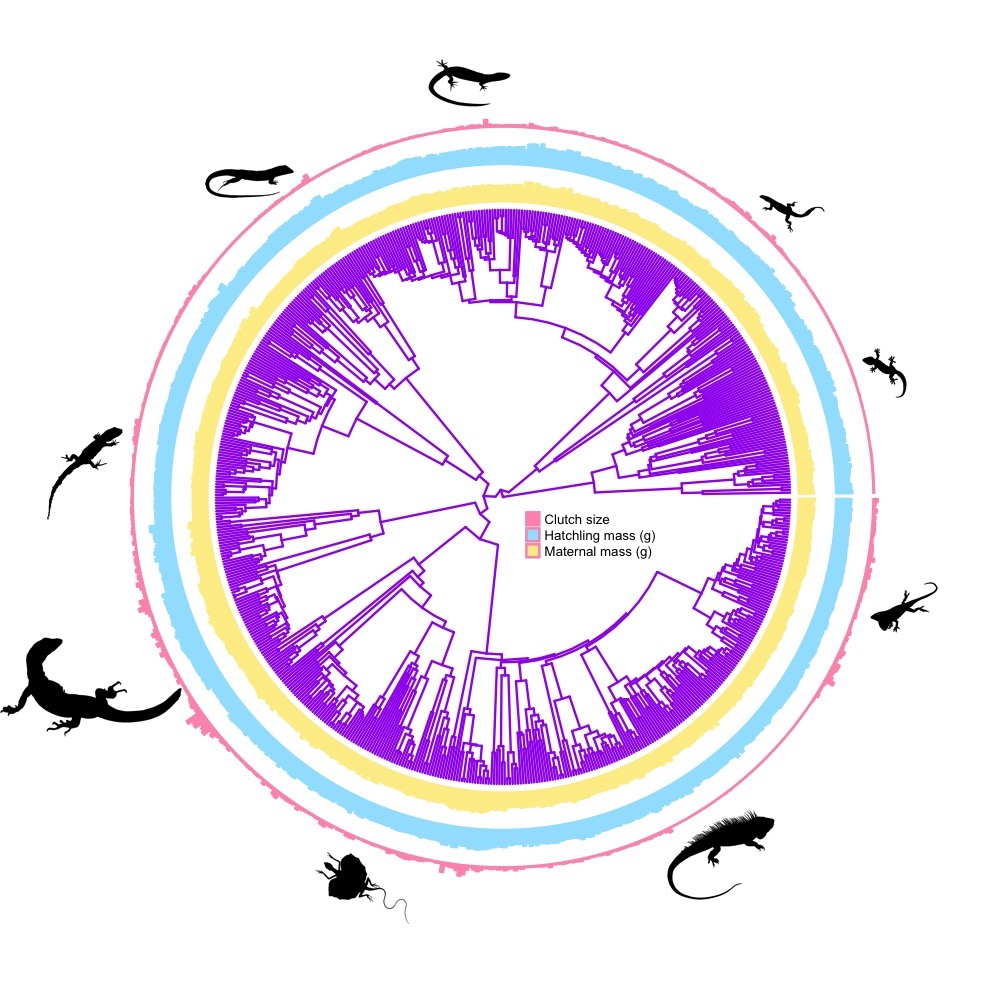
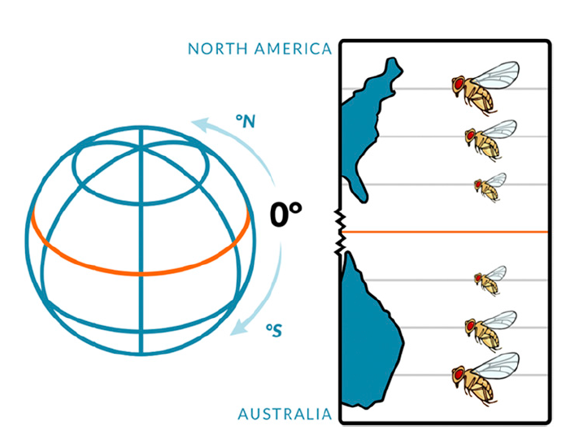
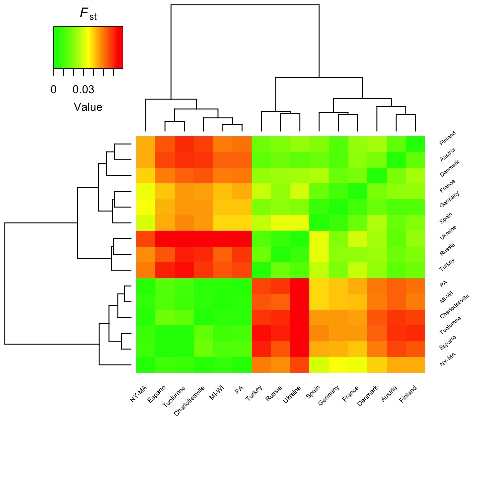
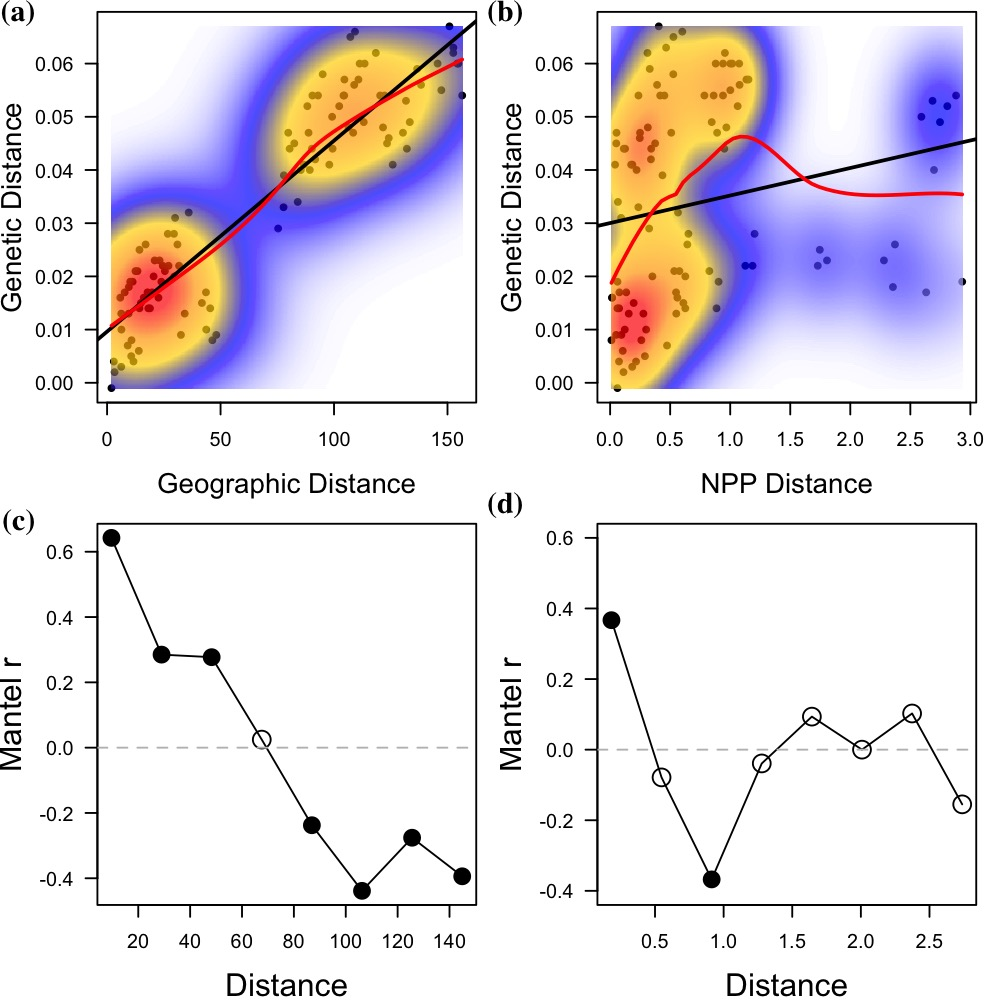
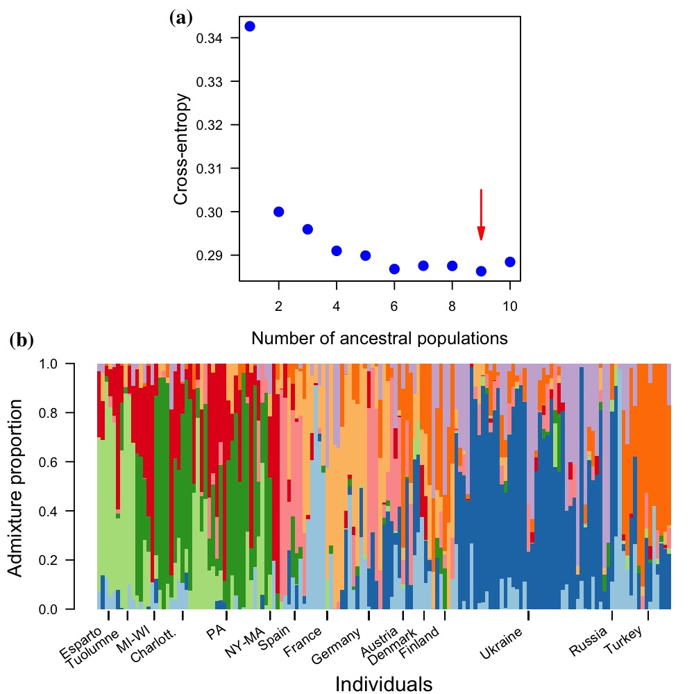
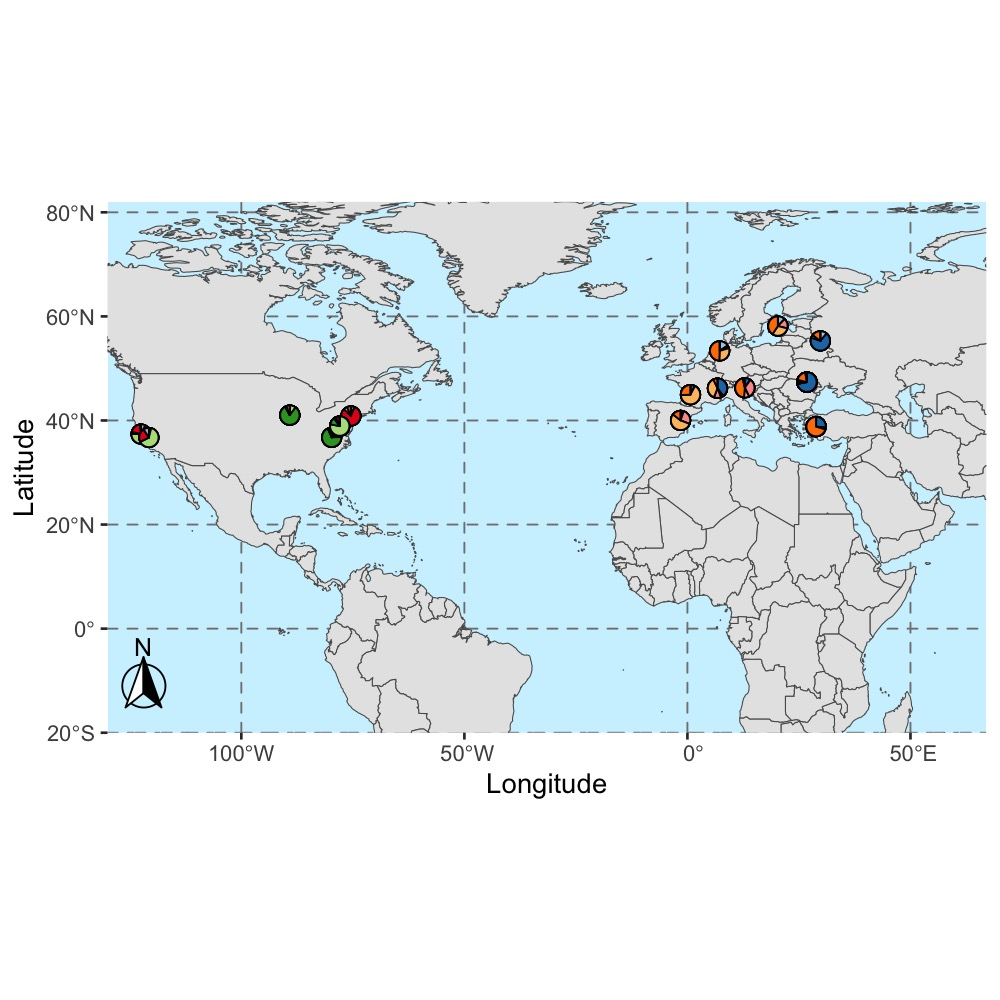

```{r echo = TRUE, include = FALSE}

library(icons)
library(emo)
library(xaringan)
library(pagedown)
library(rmarkdown)
library(knitr)
library(kableExtra)
library(car)
library(lattice)

#source("render_toc.R")


```

# Background {-}

<body>
    <p align="justify">
	Life-history theory consists of models designed to explain how environmental factors shape the evolution of survival, growth, and reproduction [@roff2002life; @stearns1992evolution]. Much of this theory focuses on the covariation of body size and reproductive traits, given a tradeoff between the size and number of offspring [@smith1974optimal]. The optimal covariation depends on ways in which body size affects the availability of energy, the constraints on reproduction, and the survival of offspring [@de1992acquisition; @van1986acquisition; @parker1986optimal]. Often, larger females have more resources to spare, can carry more offspring during gestation, pass larger offspring during birth, or provide better care after birth. These factors influence the constraints on or the benefit of specific reproductive tactics. For example, when the abdominal cavity and pelvic opening constrain offspring size, larger females can produce larger offspring. Conversely, a small female may be unable to produce an offspring of the optimal size when this size exceeds the physical constraint [@congdon1987morphological; @du2005does; @shine1992relative; @sinervo1991proximate; @vitt1978body]. This constraint results in a positive relationship between maternal size and offspring size [@oufiero2007importance], in which each female produces the largest egg possible for its body size.
	</p>
	<p align="justify">
	Natural selection can produce a similar relationship when larger females have greater surplus energy [@parker1986optimal]. Depending on both its foraging efficiency and the availability of resources, a larger female should use its additional energy to produce larger clutches. However, given a tradeoff between offspring size and offspring number, the investment in more offspring may be balanced by a decrease in the size of offspring. Similarly, when increasing the number of offspring increases competition among the resulting siblings, a female should use additional energy to produce larger offspring instead of more offspring. Interestingly, a mixed strategy can be optimal when intraspecific competition and offspring size both exert important influences on offspring survival; in such cases, larger females should lay larger offspring and larger clutches [@parker1986optimal].
	</p>
	<p align="justify">
	Because growth and body size are affected by environmental conditions, the covariation among abiotic factors should shape the evolution of life-history traits. Temperature is a well-known factor that directly and indirectly affects the evolution of the life history. The direct effect occurs when environmental conditions determine the relationship between the size and performance of offspring. Warmer environments often promote a high relative growth rate, potentially reducing the minimal size of offspring. In such cases, a female can produce more, smaller eggs as the optimal reproductive tactic. The indirect effect occurs because temperature greatly affects the size at which an organism reproduces [@atkinson1994temperature; @atkinson1995effects; @atkinson1997organisms]. When exposed to a warmer environment, an organism may grow faster but mature younger at a smaller size, a pattern of phenotypic plasticity observed among some ectotherms [@ashton2002amphibians; @berrigan1994reaction; @sibly1994rearing] and many endotherms [@ashton2000bergmann; @bergmann1848verhaltnisse]. If a warmer environment causes an organism to reproduce when younger and smaller, the smaller parent should make fewer or smaller offspring. In addition, variation in body size may also depends on precipitation, which is a good predictor of primary production [@yom2006geographic; @mcnab2010geographic]. Generally, abundant precipitation and radiation increase the rate of photosynthesis [@cramer1999comparing], which provides the energy required for growth and reproduction of organisms at higher trophic levels. If more productive areas enable organisms to consume more prey, one should expect these organisms to mature younger at smaller size; this indirect effect on maternal size should affect the size and number of offspring of the mother, as discussed earlier.
	</p>
	<p align="justify">
	In addition to the effects of the environment, the foraging efficiency of an organism may profoundly influence its life history. The ability of an organism to gather and assimilate more food may promote follicular growth during the reproductive season; it may also increase energy stores to initiate reproduction, and it may reduce age at first reproduction. For example, female vipers that had good body condition early in vitellogenesis produced large litters [@bonnet2001short]. Similarly, vipers that gained more mass during follicular growth produced larger offspring. Early reproduction gives offspring sufficient time to mature in the same year that they hatched, which enables them to participate as adults in the subsequent breeding season [@hahn1965fat].
	</p>
	

## Current state of knowledge {-}
	<p align="justify">
	Although a covariation among environmental and maternal factors is expected to drive the evolution of the life history, most studies have focused on temperature as the main selective pressure. This bias has resulted in a wealth of conflicting results in the current literature as several comparative and species-specific studies have found no consistent trend. For instance, an analysis of over 100 studies, [@atkinson1994temperature] concluded that in more than 80% of the cases, decreased temperature leads to maturation later at a larger size. However, the variation among populations in natural environments paints a more complex picture. Given that environmental temperature generally increases with decreasing latitude, we should expect to observe a positive relationship between latitude and offspring size. Interestingly, a meta-analysis by @marshall2018global revealed no general relationship between latitude and offspring size; relationships ranged from strongly negative to strongly positive. Moreover, the variation among natural populations likely reflects a combination of phenotypic plasticity and genetic divergence. A recent experiment by [@kouyoumdjian2019transplanting] illustrates this point. They compared the reproductive traits of lizards from low or high elevation to that of lizards transplanted from low elevation to high elevation. Lizards from high elevation produced larger eggs than did lizards from low elevation; however, lizards transplanted to high elevation produced eggs of intermediate size. Thus, the difference in egg size between populations might partly stem from genetic factors, as well as environmental conditions during early development. Moreover, body size has diverse effects on reproductive traits, when analyzed independently of temperature. Larger females increase annual biomass production [@meiri2012ecology], produce more eggs [@le2020influence], or both larger and more eggs [@warner2008maternal]. If these diverse patterns reflect diverse processes among taxa, a model focused on a single mechanism would be unable to explain variation in reproductive traits. Therefore, a unified approach to examine the combined effects of different environmental and maternal factors on the broad-scale variation in reproductive traits might provide the best insight.
	</p>
	<p align="justify">
	Although experimental data on foraging efficiency are limited, comparative methods have been used to explore how foraging mode and life-history traits have evolved. These interspecific analyses have focused mostly on the reproductive effort of lizards. The earliest analysis of 22 species revealed an interesting pattern: sit-and-wait species had a greater reproductive effort than widely-foraging species [@vitt1982ecological]. The authors suggested that widely-foraging species might have to carry fewer or smaller offspring, because moving long distances with a voluminous clutch compromises speed, which in turn decreases the chance of escaping a predator. A subsequent analysis of data for 50 species of lizards supports this result by testing a model in which predation risk increased with increasing reproductive effort [@vitt1982ecological]. Roff (2002)[@roff2002life] extended support for this model in a comparative analysis of 130 species of lizards. However, none of these early analyses controlled for potential phylogenetic correlations that might generate spurious relationships between foraging mode and reproductive effort [@felsenstein1985phylogenies], especially because foraging mode varies more among families of lizards than within them. A more recent analysis, using phylogenetic comparative methods, failed to detect a significant relationship between foraging mode and reproductive effort [@mesquita2016life]. Thus, the long-standing prediction of a relationship between foraging mode and life-history traits is currently unsupported.
	</p>
	</p>
	<p align="justify">
	The first two chapters of this manuscript focus on a macroevolutionary approach to understand how variation in environmental conditions and maternal factors, including their foraging mode, affect the reproductive traits of lizards. The last two chapters rely on a microevolutionary approach to examine the evolution of foraging behavior in *Drosophila melanogaster*.
	</p>
	
# Chapter: Macroclimatic and maternal effects on the evolution of reproductive traits in lizards

## Introduction
	<p align="justify">
	Much of life-history theory rests on fundamental assumptions about constraints on the acquisition and allocation of energy to growth and reproduction. In general, the allocation of energy to reproduction depends on maternal size, which in turn depends on environmental factors experienced throughout the life of the mother (Figure \@ref(fig:fig1)).
	</p>
	<p align="justify">
	Phylogenetic path analysis is an effective way to test hypotheses on the relationships among macroclimatic factors, maternal factors, and reproductive traits of lizards. Previously, [@angilletta2006direct] combined path modeling, phylogenetic analysis, and information theory to infer the most likely relationships among environmental temperature, body size, and reproductive traits for 19 populations of sceloporine lizards. They found that temperature likely affects the number and size of offspring indirectly, via its effect on maternal body size. Since then, other researchers compiled published data for body sizes and reproductive traits of several species of lizards [@meiri2008evolution; @meiri2018traits; @meiri2012ecology; @meiri2015squamate; @warne2008reproductive]. Here, we use these data to evaluate competing hypotheses about the evolution of reproductive traits through phylogenetic path analyses (Figure \@ref(fig:fig1)). In doing so, we found that annual precipitation is the major driver of the life history. By using phylogenetic path analysis, we suggest a more general mechanism underlying the evolution of life-history traits of lizards.
	</p>
## Materials and Methods
	<p align="justify">
	We used published estimates of life histories for 486 species of lizards, belonging to 34 families. We used the mean snout-vent length for hatchlings or neonates (mm), and adult females, as a measure of body size among species. Similarly, we averaged the lowest and highest reported means of clutch or litter sizes for each species (see @meiri2018traits for details). We used the length of hatchlings as an estimate of offspring size, rather than the mass of eggs, because the latter might reflect variation in water content rather than energy content in species of lizards that lay poorly calcified eggs [@deeming2004reptilian; @meiri2015squamate]. Moreover, hatchling size can be estimated for viviparous species as well as oviparous species.
	</p>


<style>

p.caption {
  font-size: 0.9em;
  text-align: justify;

}

caption {

  font-size: 0.9em;
  text-align: justify;

}


</style>

```{r fig1, echo = FALSE, comment = FALSE, fig.align = "center", fig.cap = "Path models depicting relationships among body temperature and life-history traits derived from optimality models. Abbreviation in the path diagrams are as follows: BT = body temperature; CS = clutch size; FS = maternal length; HS = hatchling/neonate length; PP = primary production; PR = annual precipitation."}


knitr::include_graphics("imgs/rev_hyp_bt.jpeg")

```
	<p align="justify">
	Because the range of nearly all reptiles have been recently mapped [@roll2017global], we could obtain data on annual air temperature and annual precipitation across the range of each species. These climatic variables derived from the monthly values of temperature and rainfall for global land areas at a resolution of 30 s [@fick2017worldclim]. Similarly, we obtained data on log-transformed values of net primary production—the net amount of solar energy converted to plant organic matter through photosynthesis measured in units of elemental carbon. This measure represents the primary source of trophic energy for the world’s ecosystems [@imhoff2004global]. We used polygonal range maps representing species extent of occurrence to run a zonal statistical algorithm in the software QGIS version 3.22.2-Białowieża; this algorithm enabled us to extract the means of climatic data across pixels of a map for each species. In addition to extracting climatic data, we also gathered published records of body temperature measured in the field for 320 species. These data consist of an average of the minimal and maximal temperatures reported in the literature [@meiri2018traits].
	</p>
	
## Statistical analyses
	<p align="justify">
    We tested our hypotheses (see Figure \@ref(fig:fig1)) by performing phylogenetic path analysis of data of body temperature, and environmental temperature. Examining the explanatory power of competing models involving different relationships among variables enabled us to identify the most plausible hypothesis given the available data, and thus infer the relative importance of mechanisms described by optimality models. These analyses were performed with the *phylopath* library of the Statistical Software R version 4.0.5 [@van2018phylopath; @team2013r], and a recent time-calibrated phylogeny for squamate taxa [@zheng2016combining]. We calculated each model’s goodness of fit with the Fisher’s C statistic [@shipley2000new], obtained as follows:
	</p>

	\[C = -2\sum_{i=1}^{k}ln(p_{i}) \]
	
	<p align="justify">
	where $k$ is the number of conditional independencies in the minimal set and $p_{i}$ is the null probability associated with each of the predicted independence claims tested. A conditional independency specifies the list of pairs of variables that are statistically independent conditioning on a set of other variables in the causal model. For example, a conditional independency that supports one of our hypotheses relates body temperature (BT), maternal size (FS) and clutch size (CS; see Figure \@ref(fig:fig1)b). In this example, clutch size is d-separated from body temperature, which means that there is not an arrow linking these variables (or “vertices”) in the directed acyclic graphic. Maternal size is considered the causal “parent” of both body temperature and clutch size, because it is the variable directly linked with both vertices (BT and CS). It is possible now to translate these d-separation statements to statistical linear models in which we test the independence of clutch size and temperature, conditioning on their parent, maternal size. The C statistic is a maximum likelihood estimate that follows a $x^2$ distribution with degrees of freedom $df=2k$. Therefore, it provides a convenient statistic for testing the goodness of fit of the whole path model [@shipley2013compared]. The path model does not provide a good fit to the data if the $p$ value of the $C$ statistic is below the alpha value (0.05). We compared models using a modified version of the Akaike Information Criterion ($AIC$) known as the $C$ statistic Information Criterion ($CIC$), proposed by [@hardenberg2013disentangling]. Here, we calculated the $CIC_{c}$, which is the equivalent of $CIC$ with a correction for small sample sizes, as follows:
	</p>
	
	\[CIC_{c}=C+2q\frac{n}{(n-1-q)}\]
	
	<p align="justify">
	where $C$ is the maximum likelihood of the particular model, $q$ is the number of parameters estimated in the path model, and $n$ is the sample size (number of species). The most likely model has the lowest $CIC_{c}$ value [@burnham2002practical].
	</p>
	<p align="justify">
	Our data analyses were entirely based on full model averaging, by which one calculates a likelihood-weighted average of parameters among all models ranked. Model averaging causes the path coefficients that do not occur in all models to shrink toward zero [@van2018phylopath]. We reported the conditional independencies that supported the averaged model. We also reported the p-values of each independence statements, and an estimate of the Pagel’s $\lambda$ to account for phylogenetic non-independence of each statement. The parameter $\lambda$ can vary between 0 and 1; a value of 0 for a conditional independency indicates that the relationship between the life histories involved is not constrained by the phylogeny, whereas a value of 1 indicates the converse.
	</p>


## Results
	<p align="justify">
	Phylogenetic path analyses revealed that annual precipitation directly and indirectly affected the evolution of the reproductive traits in lizards (Figure \@ref(fig:fig2)). The direct effect stems from its negative relationship with hatchling size, while the indirect effect is mediated by its effect on maternal size. These analyses also indicate that body temperature had little or no effect on the evolution of reproductive tactics, either directly or indirectly. We drew this conclusion from the coefficients derived from full model averaging, which indicated negligible effects of body temperature on maternal size and hatchling size (Figure \@ref(fig:fig2)a). Importantly, we found a similar pattern when using the mean environmental temperatures across the species range as an independent variable in our analysis (Figure \@ref(fig:fig2)b).
	</p>
	<p align="justify">
	Our analyses also revealed that maternal size greatly determined the evolution of hatchling size and clutch size. Specifically, larger females simultaneously produce larger offspring and more offspring (Figure \@ref(fig:fig2)). By accounting for maternal size in our phylogenetic path analysis, we observed the expected negative relationship between hatchling size and clutch size. Likely, larger females produce larger clutches of larger offspring by having more surplus energy to allocate to reproduction (Figure \@ref(fig:fig3)).
	</p>


```{r fig2, echo = FALSE, comment = FALSE, fig.align = "center", fig.cap = "Best-fit models of the evolution of reproductive traits considering body temperature (a) and environmental temperature (b) as independent variable. Thicker arrows indicate stronger effects. Values in parentheses denote the standard errors of the path coefficients."}

knitr::include_graphics("imgs/rev_pannel.jpeg")

```

```{r fig3, echo = FALSE, comment = FALSE, fig.align = "center", fig.cap = "Evolution of the reproductive effort among 669 species of lizards. The dataset used to perform path analyses was reduced to 486 species because we could not extract data of climatic variables for all species present in the phylogeny."}



```
## Discussion
	<p align="justify">
	A model describing a direct and an indirect effect of precipitation on the evolution of reproductive traits was strongly supported (see Figure \@ref(fig:fig1)g). On one hand, we found a negative relationship between precipitation and hatchling size. On the other hand, we found a positive effect of precipitation on maternal size. Both relationships might reflect selective pressures on body size associated with food availability. Greater precipitation often results in greater primary production, which translates to greater food abundance for lizards [@yom2006geographic; @mcnab2010geographic]. In a more productive environment, a juvenile lizard could mature younger at smaller size. Additionally, given the tradeoff between the size and number of offspring, a mature lizard should produce more, smaller offspring in an environment that favors growth. Although the averaged model indicates no strong direct effect of primary production on maternal size (Figure \@ref(fig:fig2)a), our analysis revealed that a model including this path should also be considered important based on the $\Delta CIC_{c}$ (Figure \@ref(fig:fig4)). Alternatively, we consider other mechanisms by which precipitation can directly influence body size. The water-conservation hypothesis provides one such mechanism. This hypothesis predicts stronger selection for large size in dry environments, given that the size-specific rate of water loss decreases with increasing size [@nevo1973adaptive; @olalla2009geographic; @gouveia2016geographical; @pincheira2008evolution].
	</p>
```{r fig4, echo = FALSE, comment = FALSE, fig.align = "center", fig.cap = "Relative importance of the causal models describing the evolution of reproductive traits in lizards."}


```
    <p align="justify">
	The absence of a thermal effect on the evolution of reproductive tactics might partially be explained by thermoregulation. Many species of lizards use behavior and physiology to buffer variation in environmental temperature [@huey2003behavioral]. This buffering ability reduces selective pressures on thermal physiology, slowing evolutionary divergence over space and time [@bogert1949thermoregulation; @buckley2015thermoregulatory; @huey2003behavioral]. The conservation of thermal tolerance within species has been widely recognized [@buckley2015thermoregulatory; @van1990evolutionary], but this phenomenon is also evident among some species of lizards [@cruz2009thermal; @sunday2011global]. Body temperature constrains life histories because it exerts an important influence on the acquisition of energy required for growth and reproduction. Normally, the detection, capture, ingestion, digestion, and assimilation of food are processes that determine the acquisition of energy. These processes perform well over an optimal range of body temperatures and perform poorly at temperatures outside this optimum [@huey1982temperature]. Whether a lizard’s optimal temperature for performance remains similar in space and time depends on the effectiveness of thermoregulation. A thermoregulating lizard might bask in open areas more often at high altitudes or latitudes, but it might use shaded areas more often at low altitudes or latitudes [@adolph1990influence; @rand1964ecological]. Consequently, the optimal body temperatures of species from different altitudes or latitudes might not change drastically [@huey2003behavioral]. If this behavior enabled some lizards to maintain their body temperature close to the thermal optimum regardless of the climate, thermoregulation would have slowed the divergence of life-history traits among species. Because nocturnal lizards have fewer opportunities to behaviorally thermoregulate than diurnal lizards do, we expect temperature to have a greater effect on the reproductive tactics of these lizards.
	</p>
	<p align="justify">
	Additionally, local adaptation of thermal physiology among species might reduce the impact of environmental temperature on the life history of lizards. If the preferred body temperatures of species have diverged to track the environmental temperatures of their habitats, natural selection would favor a subsequent shift in the thermal optima for performance [@huey1987phylogenetic]. This coadaptation of thermoregulatory behavior and thermal physiology would enable each species to perform best at the body temperature commonly experienced in its environment. In lizards, [@bauwens1995evolution] found a significant correlation between the preferred temperature and the thermal optima for sprint speed among 13 species of lacertids. Similarly, [@huey1993evolution] found that thermal optima for sprinting correlated strongly with field body temperature among 19 species of iguanid lizards. Thus, the coadaptation of thermoregulatory behavior and thermal physiology seems a likely factor contributing to the patterns of interspecific variation that we observed in general among lizards.
	</p>
	<p align="justify">
	Our study indicates that precipitation is the most likely driver of the evolution of reproductive traits in lizards. Although biologists have intensely debated the mechanisms by which temperature affects body size [@angilletta2009thermal; @atkinson1997organisms; @partridge1996thermal], we found no consistent relationship between temperature and body size among species of lizards. Interestingly, we now know that lizards with larger amounts of reproductive resources produce both larger hatchlings and larger clutches. Although we do not know the selective pressures responsible for this pattern, theoretical models tell us that parental care or intraspecific competition could play a role [@parker1986optimal]. In lizards, we lack experimental evidence that larger females provide better parental care. We also do not know the relationship between offspring size and competitive ability for most species. Therefore, empirical evidence of this nature would clarify whether these mechanisms play any role in the evolution of life histories in lizards. For longer-lived species such as lizards, experimental studies of life-history evolution have lagged behind comparative studies. Still, phylogenetic path analysis has enabled us to disentangle some evolutionary relationships among life histories. This analysis sharpens our focus on mechanisms underlying major evolutionary patterns, stimulating the development of a more general life-history theory.
	</p>


# Chapter: The correlated evolution of foraging mode and reproductive effort in lizards

## Introduction
	<p align="justify">
	Life-history theory suggests that the optimal reproductive effort of an organism is affected by factors such as energy acquisition and predation risk. The observation that some organisms actively search for their prey and others ambush them creates the expectation of different energy needs and predation risk associated with each foraging behavior, the so-called "foraging-mode paradigm". In vertebrates, the foraging behaviors lie along a continuum, ranging from the energetically demanding strategy of searching for prey to the energetically conservative strategy of ambushing prey [@pianka1966convexity; @perry1999evolution]. During the past 50 years, ecologists have developed a set of hypotheses about how an organism’s foraging mode relates to its life history [@vitt1978body; @vitt1982ecological; @webb2003does; @dunham1988life]. These relationships stem from two major assumptions (Figure \@ref(fig:fig5)). First, a widely-foraging lizard spends more energy while foraging than a sit-and-wait lizard, but might also consume enough food during an activity season to have more surplus energy [@huey1981ecological; @anderson1988energetics; @anderson1981contrasts; @nagy1984field; @bury2021energy; @stuginski2018phylogenetic]. However, a sit-and-wait lizard might have a more diverse diet, because it encounters prey less frequently than a widely-foraging lizard does [@glaudas2019foraging]. Second, a widely-foraging lizard could suffer a greater risk of predation when movements are conspicuous to predators [@cooper2004tradeoffs]. Risk of predation might also affect the evolution of reproductive effort, because carrying a greater mass of offspring reduces a female’s ability to evade a predator [@shine1980costs]. Both a greater energy supply and a greater mortality risk would select for a genotype that matures at an earlier age and allocates more energy to reproduction, manifested as more or larger offspring [@bonnet2001short; @silva2020reproduction]. Finally, the load associated with food consumption may compromise the speed of an animal, increasing its vulnerability to predators [@cooper2000tradeoffs; @werner1993ecological]. In this model, a suite of traits associated with foraging mode would coadapt to the spatiotemporal distributions of prey and predators.
	</p>
	
```{r fig5, echo = FALSE, comment = FALSE, fig.align = "center", fig.cap = "A conceptual model depicting putative relationships among foraging behavior, energetics, predation risk, and reproductive effort. The predicted relationships were derived from theoretical models of life-history evolution."}


```		
	<p align="justify">
	Despite the wealth of conjecture, these hypothetical relationships among foraging mode and other traits have been assessed in only a handful of cases. Ideally, one would isolate each relationship and conduct experiments to quantify the evolution of traits in a controlled environment [@huey1986comparative]. However, such data are difficult to gather for many species and will probably remain rare. For instance, limited circumstantial evidence exists for the putative relationship between foraging mode and predation risk. Stomach contents of vipers suggested that widely-foraging species of lizards are more vulnerable to predators than sedentary species [@huey1981ecological], but a number of confounding factors can explain this observation as well as foraging mode can. Alternatively, researchers have evaluated the relationship between mortality and life-history traits with no emphasis on foraging behavior. For example, experimental evolution with guppies and fruit flies revealed that genotypes that evolved in risky environments developed more rapidly, matured at a smaller size, and reproduced earlier in life than did genotypes that evolved in safe environments [@stearns1992evolution; @reznick2001evolution]. From these results, we expect that a greater risk of predation among widely-foraging species selects for greater reproductive effort; however, given the scarce evidence, we cannot conclude whether foraging mode generally affects predation risk.
	<p align="justify">
	Here present the first evidence that the evolution of widely-foraging in lizards was associated with the evolution of greater reproductive effort, specifically among large-bodied species of lizards. This evidence comes from a comparative analysis of foraging mode and reproductive effort comprising 485 species of lizards from 32 families. In this analysis, we inferred the evolutionary history of foraging modes, complementing past reconstructions of ancestral states [@miles2007morphology]. In contrast to previous analyses, our study partially supports the prediction of theoretical models of the optimal reproductive effort, paving the way for ecologists to test mechanistic hypotheses at the intraspecific level.
	</p>
	
## Materials and Methods
	<p align="justify">
	We used published estimates of life history and foraging behavior for 485 species of lizards grouped in 32 families, excluding amphisbaenians and snakes. These data represent a subset of those assembled by ecologists from primary and secondary literatures [@meiri2018traits]. We defined reproductive effort as the mean product of offspring mass and offspring number. Accordingly, we computed the product of the mean scaled mass index for hatchlings or neonates, $\hat M(g)$, and the mean clutch or litter size for each species of lizards. This product was interpreted in terms of reproductive effort after adjusting for the mass of the parent (i.e., the mean $\hat M(g)$ of adult females). The scaled mass index standardizes body mass at a given fixed value of a linear body measurement, based on the scaling relationship between mass and length [@peig2009new]. We first estimated hatchling mass and maternal mass from values of snout-vent-length (SVL) using published allometric equations [@feldman2016body; @meiri2015squamate; @meiri2018traits]. Then, we computed $\hat M$ as follows:
	</p>
	
	\[\hat M=M_i(\frac{L_0}{L_i})^b_{SMA} \]
    
	<p align="justify">
	where $M_i$ and $L_i$ are the raw body mass and the linear body measurement of individual $i$,  respectively; $b_{SMA}$ is the scaling exponent estimated by the standardized major-axis regression of $ln(M)$ on $ln(L)$; $L_0$ is an arbitrary value of $L$ (e.g., the arithmetic mean of SVL values for the study species); and $\hat M_i$ is the predicted body mass for individual $i$ when the linear body measure is standardized to $L_0$. The scaled mass index performs best as a predictor of variation of energy stores, such as fat as well as other body components [@peig2009new].  Given that we could not find clutch frequencies and ages of first reproduction for all of the widely-foraging and sit-and-wait species in this study, our analysis focused on reproductive effort in a single event rather than the lifetime reproductive effort, which corresponds to the total production of offspring over the lifetime of a female.
	</p>
	<p align="justify">
Among species of lizards, widely foraging females and sit-and-wait females have been compared mostly in terms of their relative clutch mass. Relative clutch mass accounts for variation in energy availability among individuals by computing the ratio of reproductive mass to maternal mass, where mass is a proxy for energy. Although relative clutch mass is commonly used as measure of reproductive effort, regressing this index on female body mass for further analyses might be problematic, because ratios of random numbers regressed against their denominator will yield spurious correlations [@atchley1976statistical; @packard1988misuse]. By regressing the mean product of offspring mass and offspring number on maternal mass, the slope of the linear relationship can be interpreted as reproductive effort—proportion of mass allocated to reproduction at a given maternal mass—which enabled us to avoid statistical issues associated with the analysis of ratios.
    </p>
	<p align="justify">
	We defined the foraging mode of a species based on whether it has been reported as ambushing prey (sit-and-wait forager), searching for prey (widely foraging), or using a mixed strategy (mixed). Although this categorization seems somewhat artificial, most species of lizards clearly belong to one of these categories [@perry1999evolution; @huey1981ecological]. We focused our analyses only on carnivores, because herbivores do not fit into the classical paradigm of foraging modes [@pianka2003lizards].
	</p>

## Statistical analyses
	<p align="justify">
	To determine the appropriate model of evolution, we used a set of continuous-time, discrete-state Markov-chain models to sample the character histories from their posterior probability distribution [@huelsenbeck2003stochastic], and a time-calibrated phylogeny of squamate reptiles [@zheng2016combining]. We rooted the tree with the tuatara (*Sphenodon punctatus*) as the outgroup for our study taxa. Based on previous analyses, we coded this outgroup as a sit-and-wait species [@pianka2003lizards; @vitt2003history]. However, we also performed the analysis with no outgroup to evaluate the consistency of our estimates. Additionally, we estimated phylogenetic signal (character dispersion on a phylogeny) using Fritz and Purvis' $D \ test$, available through the function *phylo.d* in the "caper" package of R, version 1.0.1 [@team2013r; @fritz2010selectivity; @orme2013caper].
	</p>
	 <p align="justify">
	We used Phylogenetic Generalized Least Squares (PGLS) to model the relationship among maternal mass, foraging mode, and reproductive output. PGLS models enabled us to account for non-independence of the data [@felsenstein1985phylogenies; @harvey1991comparative]. To do so, we used the *gls* function from the “nlme” package of R, version 3.1.153 [@team2013r; @pinheiro2007linear]. We included maternal mass and foraging mode as independent variables and the mean product of hatchling mass and clutch size as the dependent variable. Then we fitted multiple models assuming that the species trait values evolved via a Brownian motion model, an Ornstein-Uhlenbeck motion model, and a Pagel's lambda model using the R package "ape" version 5.6.2. To evaluate the models' goodness of fit, we used information-theoretic criteria such as $AIC_c$. We ranked candidate models accordingly and selected the most likely one (lowest value of AICc) for inferences. To control for variation in maternal size among species, we examined models in which maternal mass was standardized ($\hat M$). This analysis enabled us to deal with outliers, thus increasing the robustness of our conclusions.
	</p>
	
## Results
    <p align="justify">
	The evolutionary transitions in foraging mode among species were best described by a model in which rates of evolution were equal among foraging modes, referred to as the equal-rates model (ER). According to the posterior probabilities from stochastic mapping, sit-and-wait foraging is the most likely ancestral state of all lacertilians (Figure \@ref(fig:fig6)). We drew this conclusion from the ancestral state reconstruction analysis including the outgroup (i.e. the tuatara) and with no outgroup. Sit-and-wait foraging evolved in two major clades of lizards; near the root of the tree, we found strong evidence suggesting that the ancestor of the basal gekkotans was likely a sit-and-wait predator. Likewise, the ancestor of the more derived iguanians was likely a sit-and-wait predator. During the Jurassic and middle Cretaceous, major transitions from sit-and-wait foraging to widely foraging seemed to have occurred in the ancestors of Scincoidea, Lacertoidea, and Anguimorpha. However, a major reverse transition from widely foraging to sit-and-wait foraging has also occurred during the Jurassic, in the ancestor of iguanians. The $D$ test for phylogenetic signal indicated that foraging mode is phylogenetically conserved among lizards ($D=-0.14, \ p[D<1]=0, \ p[D>0]=0.80$). Accordingly, closely related species tend to exhibit the same foraging mode, but this similarity decreases as phylogenetic distant increases.
	</p>
	<p align="justify">
	The evolution of reproductive effort in lizards was driven by an interaction between maternal mass and foraging mode (Table \@ref(tab:tab1)). The information-theoretic approach revealed that a model including this interaction was strongly supported (Table \@ref(tab:tab2)). Widely foraging was associated with the evolution of greater reproductive effort than was sit-and-wait foraging, specifically in large-bodied species of lizards (Figure \@ref(fig:fig7)a). Yet, this difference seemed small when hatchling mass and maternal mass were standardized (Figure \@ref(fig:fig7)b). A model in which mass was standardized, $\hat M$, suggested that species adopting a mixed-foraging strategy evolved the greatest reproductive effort (Figure \@ref(fig:fig7)b).
	</p>

```{r tab1, echo = FALSE, comment = FALSE}

table1 <- read.csv("table1.csv", row.names = 1)

kable(table1, digits = 3, row.names = TRUE, caption = 'Analysis of deviance table (Type III tests) for the most likely
model, based on the ranking of $AIC_c$ for potential candidate models.') %>%
  kable_styling(bootstrap_options = "basic", full_width = TRUE, position = "center")

```
```{r fig6, echo = FALSE, out.width = "100%", comment = FALSE, fig.align = "center", fig.cap = "Random sample of stochastic character maps depicting the evolution of foraging mode in 485 species of lizards. Bars at the tips of the phylogeny represent log-transformed values of reproductive effort for all lizards, but not the outgroup, *Sphenodon punctatus*. Pie charts on internal nodes represent posterior probability estimates resulting from 1,000 simulations of the character histories. Major clades are enumerated as follows: 1) Gekkota, 2) Scincoidea, 3) Lacertoidea, 4) Anguimorpha, 5) Toxicofera, and 6) Iguania. Lizard photos by Mark O’Shea."}

knitr::include_graphics("imgs/Figure2.jpeg", )

```
	
```{r fig7, echo = FALSE, comment = FALSE, fig.align = "center", fig.cap = "Effects of maternal mass and foraging mode on the evolution of reproductive effort of lizards, as determined by phylogenetic generalized least squares analysis. (a) Difference in reproductive effort among foraging modes assuming body mass as a proxy for energy. (b) Difference in reproductive effort among foraging modes assuming the scaled mass index as a proxy for energy."}

knitr::include_graphics("imgs/Figure3.jpeg")

```
<br>

```{r tab2, echo = FALSE, comment = FALSE}


table2 <- read.csv("table2.csv", row.names = 1)

kable(table2, digits = 3, row.names = FALSE, caption = 'Contrast of parameters estimated by the most likely model, according to the information-theoretic criteria of selection.') %>%
  kable_styling(bootstrap_options = "striped", full_width = TRUE, position = "center")

```

## Discussion
    <p align="justify">
	Our analysis provides evidence that species of widely-foraging lizards have evolved greater reproductive effort, but only in heavier species (see Figure \@ref(fig:fig7)a). Presumably, this pattern stems from the ability of widely-foraging species to harvest and assimilate more resources than sit-and-wait species can. In the field, a widely-foraging lizard spends 32% more daily energy than a sit-and-wait lizard, but this extra energy expenditure is probably paid off with greater daily food consumption [@brown2007lizard]. The ability of widely-foraging lizards to forage more efficiently should reduce their risk of predation. Rapid growth by widely-foraging lizards might also cause them to outgrow the gape limitations of predators [@lynch1980evolution; @reznick1982impact]. Therefore, if body size is critical to outperform predators and outcompete conspecifics, the optimal pattern may be to grow to the maximal size that leads to the greatest reproductive effort.
	</p>
	<p align="justify">
	Our study presents the first evidence that the early shift in foraging mode—from sit-and-wait foraging to widely foraging—in the evolutionary history of lacertilians was likely accompanied by the evolution of a greater reproductive effort, specifically in large-bodied species of lizards (Figure \@ref(fig:fig6)). Yet, much variation in reproductive effort exits among species with the same foraging mode, such that ecologists must consider other factors that influence reproduction. Importantly, our study captured the effects of foraging plasticity on the reproductive effort of lizards. For instance, lizards that adopt a mixed-foraging strategy produced the greatest reproductive effort. Hopefully, our findings encourage others to investigate how foraging efficiency and predation risk associated with foraging modes influence the evolution of reproductive traits.
	</p>


# Chapter: Foraging efficiency of rover and sitter larvae of *Drosophila melanogaster*

## Introduction
	<p align="justify">
	In the previous chapter, we presented the first evidence that widely foraging species of lizards actually have greater reproductive effort than sit-and wait species, which we attributed to a greater rates of energy acquisition and mortality among mobile foragers. Thus, our work refutes the traditional view, calling into question long-standing predictions of the foraging-mode paradigm. In this chapter of my dissertation, I will pursue this area of research with an experimental approach involving the larvae of the fruit fly *Drosophila melanogaster*.
	</p>
	<p align="justify">
	Currently, analyses of the efficiency of foraging behaviors stem from measures of a few species in short periods of a season. Studies of this nature in laboratory-controlled conditions are still rare in the current literature, revealing the need for long-term studies to help us understand the evolution of foraging behavior and its connection to the life history. In *Drosophila melanogaster*, a foraging gene (*for*) is a well-established example of a gene with major effects on foraging behavior [@anreiter2019foraging]. This gene is best known for underlying the foraging behavior strategies of rover ("active foragers") and sitter ("passive foragers") foraging larvae, making this organism a good study system to test the relationship between foraging behavior and energy acquisition.
	</p>
	<p align="justify">
	The foraging efficiency of the *Drosophila* larvae can be examined based on a model of optimal feeding strategies [@schoener1971theory]. This model suggests that the energy accumulated from foraging ($m$) increases monotonically towards an asymptote (Figure \@ref(fig:fig8)). If the total energy accumulated from foraging scales proportionally with body size, an asymptotic size then suggests that foraging for twice as long would not result in twice the optimal size. For example, if two larvae differ in body size, the smaller one would reach its asymptotic size at a lower value of $m$ (Figure \@ref(fig:fig8)a). While the asymptote represents the optimal body size that an organism would reach, the ratio of the energy accumulated for growth to the time spent foraging ($\frac{m}{t}$) corresponds to its foraging efficiency. In some organisms, this ratio likely depends on their foraging mode, as well as on the abundance and distribution of food. Accordingly, if a rover larva has a higher foraging efficiency, it might grow faster and reach maturity at a smaller size than would a sitter larva that is less efficient at foraging (Figure \@ref(fig:fig8)b).
	</p>
	
```{r fig8, echo = FALSE, comment = FALSE, fig.align = "center", fig.cap = "A theoretical model relating the cumulative energy gain $m$, as a function of time spent foraging, $t$. (a) Larger larvae reach their maximum capacity at a higher value of $m$ than small larvae. (b) Rovers that are smaller but more efficient foragers may grow faster at a smaller size than larger and less efficient sitter larvae. $t_{r}$ and $t_{s}$ in (b) represent the optimal foraging time of rover and sitter, respectively.", dpi = 300}

layout(matrix(c(0, 1, 1, 0,
                0, 1, 1, 0,
                0, 2, 2, 0,
                0, 2, 2, 0), nrow = 4, ncol = 4, byrow = TRUE))


## A


bertalanffy <- function(la, k, t){

    la <- as.numeric(la)
    k <- as.numeric(k)
    t <- as.numeric(t)
    la*(1 - 4*exp(-k*t))

}

fem1 <- bertalanffy(la = 4, k = 0.3, t = seq(1, 35, 1))
fem2 <- bertalanffy(la = 4.9, k = 0.25, t = seq(1, 35, 1))

par(mar = c(2, 5, 1, 3), mgp = c(0.8, 0, 0), cex.lab = 1.2)
plot(fem1 - 0.7 ~ seq(1, 35, 1), xlim = c(-2, 35), ylim = c(-6, 8), type = "l", lwd = 2, xaxt = "n", yaxt = "n", ylab = "Cumulative energy gain (m)", xlab = "time (t)")
lines(seq(1, 35, 1) - 0.48, fem2, lwd = 2, lty = 4)
legend("topleft", legend = c("large larva", "small larva"), lty = c(4, 1), lwd = c(2, 2), bty = "n", cex = 1)
mtext("(a)", at = -6, line = 0, cex = 1, font = 2)


## B

fem3 <- bertalanffy(la = 5, k = 0.082, t = seq(1, 35, 1))
fem4 <- bertalanffy(la = 10, k = 0.21, t = seq(1, 35, 1))


par(mar = c(2, 5, 1, 3), mgp = c(0.8, 0, 0))

plot(fem3 - 0.7 ~ seq(1, 35, 1), xlim = c(4, 35), ylim = c(-6, 5), type = "l", lwd = 2,  col = "skyblue", xaxt = "n", yaxt = "n", ylab = "Cumulative energy gain (m)", xlab = " ")
lines(seq(1, 35, 1), fem4 - 8, lwd = 2, lty = 2, col = "purple")
segments(2.6, -6.5, 25, 6.2, lwd = 2)
segments(2.6, -6.5, 33.2, 6, lwd = 2)
segments(13.2, -0.5, 2.6, -0.5, lwd = 2, lty = 2, col = "purple")
segments(15.9, -1.1, 2.6, -1.1, lwd = 2, col = "skyblue")
segments(13.2, -0.5, 13.2, -7, lwd = 2, lty = 2, col = "purple")
segments(15.9, -1.1, 15.9, -7, lwd = 2, col = "skyblue")
legend("topleft", legend = c("sitter", "rover"), lty = c(1, 2), lwd = c(2, 2), col = c("skyblue", "purple"), bty = "n", cex = 1)
mtext("(b)", at = 0.6, line = 0, cex = 1, font = 2)
mtext(expression("t"[r]), side = 1, at = 13.2, line = 0.5, cex = 0.8, font = 2)
mtext(expression("t"[s]), side = 1, at = 17.2, line = 0.5, cex = 0.8, font = 2)
mtext("time (t)", side = 1, at = 25, line = 0.9, cex = 0.8)

```	

## Experimental design
    <p align="justify">
	The rover ($for^R$) and sitter ($for^S$) strains that we will use in our study have been provided by the Sokolowski lab at the University of Toronto, Canada. Flies of both strains will be separately reared on a mixture of cornmeal, corn syrup, and yeast-agar culture bottles incubated at 25$^\circ$C and 60% relative humidity in a 12:12 h LD cycle. To set up the parental populations of each strain, we will collect 100-150 females and 50-75 males and age them for 5 days for optimal fecundity [@anreiter2016foraging]. We will allow them to mate overnight in a 6 oz culture bottle with standard food. The flies will be transferred to a culture bottle oriented upside down and sealed up with a grape plate at the bottom. By doing this, we will allow the adults to lay eggs on the grape plate. We will discard the first grape plate after 24 h and place a new grape plate in the bottle opening. This will be the grape plate from which larvae will be collected the next day.
	</p>
	<p align="justify">
	The experimental set up will begin with a petri dish covered with a thin layer of agar matrix. The agar layer should be thin enough to enable us to observe a path that a moving larva would leave as it forages. Because the larvae actually feed on yeast, we will add small drops of yeast paste on the agar matrix in such a way that some petri dish will have drops of yeast uniformly distributed (Figure \@ref(fig:fig9)), and others will have the drops distributed in patches (Figure \@ref(fig:fig10)). Manipulating the distribution of yeast on the petri dish will enable us to examine the foraging efficiency of a larva when the distribution of food varies in the environment they are placed on. We will cover the test dish with a transparent lid for the larvae to remain visible during the duration of the experiments.
	</p>

```{r fig9, echo = FALSE, out.width = "80%", comment = FALSE, fig.align = "center", fig.cap = "Schematic representation of an arena with a hypothetical uniform distribution of resources.", dpi = 300}


unif <- runif(1000, min = 0, max = 100)

# Create basic plot
plot(unif, type = "n", axes = FALSE, ann = FALSE)

# Change the plot region color
rect(par("usr")[1], par("usr")[3],
     par("usr")[2], par("usr")[4],
     col = "black") # Color

# Add a new plot
par(new = TRUE)

plot(unif, type = "p", pch = 16, col = "orange", axes = FALSE, ann = FALSE)

```

```{r fig10, echo = FALSE, out.width = "65%", comment = FALSE, fig.align = "center", fig.cap = "Schematic represention of an arena with a multi-patch distribution of resources.", dpi = 300}


pat <- runif(200, min = 0, max = 300)

layout(matrix(c(1, 2, 3,
                4, 5, 6,
                7, 8, 9), nrow = 3, ncol = 3, byrow = TRUE))

par(bg = "black", mar = c(3, 1, 1, 2))

# Change the plot region color
#rect(par("usr")[1], par("usr")[3],
#     par("usr")[2], par("usr")[4],
#     col = "black") # Color

for(i in 1:9){

    plot(pat, type = "p", pch = 16, col = "orange", axes = FALSE, ann = FALSE)
}

```
	<p align="justify">
	Before the beginning of the experiments, a third instar larva will be first weighed on a precision scale and then it will be immediately transferred to the center of the test dish using a paintbrush. After covering the test dish with the transparent lid, we will record the foraging behavior of the larva using a camera placed 30 cm above the test dish. The recording will be stopped after 24 h, and the larva will be weighed once again. The difference between the final mass and the initial mass of the larva per 24 h of experiment will be our measure of foraging efficiency. The strain of the larva and the type of environment will be randomized for each trial. All larvae will be assessed at the same temperature and relative humidity.
	</p>
	<p align="justify">
	The experimental design described above consists of a $2\times2$ factorial design. The dependent variable will be the foraging efficiency (ug/h), and the independent variables will be the larval strain (sitter-rover) and type of environment (uniform-patchy). A two-factor Analysis of Variance represents an ideal linear model to analyze the data produced by the experiments.
	</p>


## Prediction
    <p align="justify">
	We predict two possible outcomes: assuming that rover larvae have a better ability to gather more food as they forage than sitter larvae do, the former would be more efficient foragers in a patchy environment, increasing their ability to eat more food per time (Figure \@ref(fig:fig11)). However, if food is readily available in the environment, rovers and sitters would eat the same amount per time (Figure \@ref(fig:fig11)).
	</p>


```{r fig11, echo = FALSE, out.width = "90%", comment = FALSE, fig.align = "center", fig.cap = "Assuming there is a $GXE$ interaction, two possible outcomes are expected: In the left pannel, a rover genotype would comsume more food than a sitter genotype. In the right pannel, however, both rovers and sitters would consume the same amount of food.", dpi = 300}

rm(list = ls())

energy <- c(4, 5, 6, 4, 5, 6, 3, 3, 5, 4, 4, 4)
pheno <- c(rep("rover", 3), rep("sitter", 3), rep("rover", 3), rep("sitter", 3))
food <- c(rep("uniform", 6), rep("patchy", 6))

mat <- cbind(pheno, food, energy)
mat <- as.data.frame(mat)
mat$energy <- as.numeric(mat$energy)

barchart(energy ~ pheno | food, data = mat, col = c("skyblue", "purple"), ylab = "Food consumption / time", scales= list(y = list(draw = FALSE)))

```

# Chapter: Geographic variation of the *for* gene revealed signatures of local adaptation in *Drosophila melanogaster*

## Introduction
	<p align="justify">
	Species distributed over broad geographic ranges face drastic variation in environmental conditions. Such species provide an opportunity to understand the mechanisms underlying evolutionary responses to environmental variation. *Drosophila melanogaster* represents a good example of a species with a widespread distribution range, being found on every continent and most islands [@markow2005drosophila]. Since the early 1900s until the present days, this species has been a central model to understand the genetic basis of adaptation [@flatt2020life]. Identifying genes underlying adaptation of populations is a key issue in evolutionary biology [@tenaillon2008quest]. For instance, the foraging gene (*for*) is best known for underlying different foraging strategies adopted by *D. melanogaster* in response to environmental variation [@anreiter2019foraging]. Detailed characterization of this gene in laboratory experiments revealed the existence of two allelic variants: rover and sitter [@sokolowski1980foraging]. In the presence of nutritive yeast, larval rovers travel longer distances and eat less than sitters do. This difference is not evident in the presence of a non-nutritive agar medium [@kaun2007natural], suggesting a gene-by-environment interaction [@burns2012gene]. Similarly, Pereira and Sokolowski (1993)[@pereira1993mutations] showed that adult rovers walked significantly farther from the food source after eating than did sitters, but there were no differences in walking behavior in the absence of food. This behavioral variation should also be observed in the wild, because food availability varies temporally and spatially across the range of *D. melanogaster*. Because these behavioral differences between rovers and sitters arise from genetic variation in the *for* gene, one should expect the frequency of alleles in this gene to vary over space and time.
	</p>
	<p align="justify">
	Extensive geographic and temporal variation in various genetic markers has been identified in *D. melanogaster* [@hoffmann2007climatic, @kapun2020genomic, @sezgin2004single]. In some cases, clinal genetic variants have been directly linked to phenotypic variants [@lee2013polymorphism, @paaby2014highly, @paaby2010identification, @schmidt2008amino]. For example, associations have been discovered between the *Adh* allozyme locus and development, as well as the *hsp70* gene and heat knockdown resistance in a mid-latitude population along the east coast of Australia. There is also good evidence indicating that *D. melanogaster* evolved Bergmann’s clines on more than one continent (Figure \@ref(fig:fig12)). When raised in a common environment, both South American and Australian flies from high latitudes developed faster and matured at larger sizes than their counterparts from low latitudes [@james1997genetic]. Similarly, seasonal stresses at high latitudes, such as overwinter survival and ephemeral food resources, impose strong selection for increased body size and somatic maintenance, whereas warm climates with ample feeding opportunities favor reduced size and decreased maintenance [@james1997genetic, @paaby2009dissecting]. Because the foraging behavior of organisms influences their ability to gather and assimilate food to fuel their maintenance requirements, one may expect the allele frequency of the *for* gene to differ in genotypes living at high latitudes and over stressful time (e.g., winter) relative to those living at lower latitudes and less stressful conditions.
	</p>
	<p align="justify">
	Although recent studies have provided good insights on the maintenance of the *for* gene polymorphism in the laboratory, the significance and dynamics of this variation are yet to be investigated in nature. Studies based on experimental evolution suggest that density-dependent selection during the larval stage of Drosophila, rather than the adult stage, can maintain genetic variation in foraging behavior. For instance, a high larval density favors the rover variant and low larval density favors the sitter variant [@sokolowski1997evolution]. Similarly, negative frequency-dependent selection promotes the increase in frequency of one variant when it is rare relative to the other variant [@fitzpatrick2007maintaining]. In addition, [@anreiter2017epigenetic] showed evidence of an epigenetic regulator of the *for* gene (the *G9a* methyltransferase) responsible for rover-sitter differences in adult foraging behavior. Specifically, they showed that rovers bearing *G9a* alleles, had significantly greater foraging success than sitters, but this rover–sitter difference disappeared when they carried *G9a* null alleles. In sum, researchers have now detailed advances on the mechanisms that produce variation in the Drosophila *for* gene under controlled conditions. Yet, our understanding of the environmental drivers of the genetic variation that controls the foraging behavior of flies in nature remains unknown. A good approach to fill this gap is referred to as genotype-environment association analysis [@joost2007spatial, @rellstab2015practical], an emerging field that integrates tools from landscape genetics and population genomics to identify the environmental factors that have shaped present-day genetic variation, and the gene variants that drive local adaptation.
	</p>
	<p align="justify">
	Here, I present results of the first genotype-environment association analysis that quantifies variation in the *for* gene among samples of *D. melanogaster* structured across space and time (Figure \@ref(fig:fig13)). These samples consist of published genomes of adult flies collected worldwide, and at least twice per site of collection (during spring and fall). Thus, not only could I test whether the allele frequency of the *for* gene change geographically, but also in response to seasonality. I found a distinct genetic structure among the samples collected in America and Europe. An analysis of genetic differentiation based on $F_{st}$ estimates revealed two major genetic clusters; one with all the American samples grouped together, and the other one grouping the European samples. Similarly, there is some degree of genetic differentiation among samples within each continent, suggesting a total of 6 ancestral populations ($k$) with unique patterns of allelic variation in the *for* gene. The results indicate that different patterns of gene flow as expected under models of isolation by environment (IBE) and isolation by distance (IBD) are likely driving the genetic differentiation among populations of *D. melanogaster*. Overall, this study is essential for understanding the mechanisms underlying the evolution of foraging behavior in *D. melanogaster*.
	</p>


```{r fig12, echo = FALSE, comment = FALSE, out.width = "50%", fig.align = "center", fig.cap = "Latitudinal life-history clines in *D. melanogaster*. On multiple continents and subcontinents, spanning temperate to subtropical/tropical regions, fly populations exhibit major differences in fitness components across latitudes.", dpi = 300}



```

<br>

```{r fig13, echo = FALSE, out.width = "100%", comment = FALSE, fig.align = "center", fig.cap = "Available data of genome-wide allele frequency estimates from >270 population-based samples of *D. melanogaster* worldwide. DGN: samples available from the Drosophila Genome Nexus project; DrosEU: samples collected by the European Drosophila Population Genomics Consortium; DrosRTEC: samples collected by the Real Time Evolution Consortium.", dpi = 300}

knitr::include_graphics("imgs/map-drosophila.png")

```

<br><br>

## Materials and Methods

**Data source** <br>
    <p align="justify">
	The data represent a subset of a dataset assembled by the Drosophila Genome Nexus project (DGN), the European Drosophila Population Genomics Consortium (DrosEU), and the Real Time Evolution Consortium (DrosRTEC). This dataset constitutes the most comprehensive spatiotemporal sampling of *D. melanogaster* populations to date. Overall, it contains data of genome-wide allele frequency estimates from $>270$ populations. Collectively, the dataset is based on sequencing of >13,000 flies collected around the world and over multiple years (2003-2018). Importantly, all our analyses relied on pooled samples stored in the Genomic Data Structure (GDS) file named "dest.all.PoolSNP.001.50.10Nov2020.ann.gds", available at [https://dest.bio/data-files/SNP-tables]("https://dest.bio/data-files/SNP-tables"). Pooled samples from this file consist of 33–40 wild-caught males as they are more easily distinguishable morphologically from similar species than females. Detailed information on quality control, mapping, SNP calling and dataset merging can be obtained from the DEST dataset mapping pipeline [https://dest.bio/sourcecode]("https://dest.bio/sourcecode").
	</p>
	<p align="justify">
     I filtered the GDS object to restrict my focus on Single Nucleotide Polymorphism variants (SNPs) in the *for* gene. As annotated at [https://flybase.org/]("https://flybase.org/") (genome assembly version 6.32), the *for* gene is found on the left arm of chromosome 2 from base pairs 3,622,074-3,656,953. I further filtered the reads to get a subset of samples collected at least once during spring and winter. Because the filtering process drastically reduced the number of individuals (pools) in a few populations, I grouped together populations from the nearest neighbor localities to ensure a minimum sample size of 5. I also applied a minimum effective coverage $N_{eff}$ filter of 28 to avoid the influence of atypical observations driven by samples with low coverage [@nunez2022cosmopolitan]. The DEST dataset provides the coordinates of each collection site, enabling one to obtain data about the seasonality of temperature and precipitation. These climatic variables were derived from the monthly values of temperature and rainfall for global land areas at a resolution of 30 s [@fick2017worldclim]. In addition, I extracted log-transformed values of net primary production (NPP)—the net amount of solar energy converted to plant organic matter through photosynthesis—measured in units of elemental carbon. This variable represents the primary source of trophic energy for the world’s ecosystems [@imhoff2004global].
	</p>
	**Quality control** <br>
	<p align="justify">
     I removed pools and SNP loci with more than 20\% missing genotypes. To do so, I used the *missingno* function from the “poppr” package of R v2.9.3 [@kamvar2014poppr]. Subsequently, I tested for deviations from Hardy–Weinberg equilibrium (HWE) using the function *hw.test* from the “pegas” package of R v1.1 [@paradis2010pegas]. This function calculated p-values of an exact test with a Monte Carlo permutation of alleles (1,000 replicates). I considered loci to be out of HWE if they deviated significantly in more than 50\% of populations. This decision was based on a “false discovery rate” correction of the p-values.
	 </p>
	**Genetic differentiation and population structure**<br>
	<p align="justify">
	To test for genetic differentiation among populations at the level of the *for* gene, I estimated pairwise values of $F_{st}$ adopting the method suggested by Weir and Cockerham (1984)[@weir1984estimating]. The $F_{st}$ values serve as a tool for describing the partitioning of genetic diversity within and among populations [@wright1931evolution]. For example, large populations among which there is much migration tend to show little differentiation with values of $F_{st}$ close to 0, whereas small populations among which there is little migration tend to be highly differentiated with values of $F_{st}$ close to 1. I used the function *gl.fst.pop* from the package “dartR” v2.7.2 [@gruber2018dartr], running 1,000 bootstraps across all loci to generate 95\% confidence intervals of the values of $F_{st}$. When the confidence intervals did not include zero, the $F_{st}$ value in question was considered significantly different from zero. To explore patterns of isolation by environment (IBE) and isolation by distance (IBD), I first performed a Partial Mantel test on genetic distance ($F_{st}$) and primary production distance, holding geographic distance (coordinates) constant. I then performed the same test but holding the primary production distance matrix constant to account for the effect of geographic distance. To do this, I used the *partial.mantel* function from the R package “vegan” v2.6-4, which ran a Monte-Carlo test based on 1,000 permutations and assessed the significance of the correlation between the distance matrices. I also evaluated the relationship between these distances with a Mantel correlogram, a method that does not make the assumption of linearity. For this test, I ran the function *mgram* from the R package “ecodist” v2.0.7 [@goslee2007ecodist], setting the number of permutations to 1,000 and using the Sturge’s rule to determine an appropriate number of classes. The function returns a matrix with one row for each distance class and 6 columns; two of which represent estimates of the Mantel *r*, and its associated p-value (see supporting code).
	</p>
	<p align="justify">
	I estimated population structure using two classical approaches: an admixture analysis and a principal component analysis (PCA). I performed the admixture analysis using a sparse negative matrix factorization method (SNMF), available in the R package “LEA” v3.2.0 [@frichot2015lea]. Similar to Bayesian clustering programs such as CLUSTER, the function *snmf* in LEA estimates individual admixture coefficients from the genomic matrix. Assuming $k$ ancestral populations, the function provides least-squares estimates of ancestry proportions and estimates an entropy criterion to evaluate the quality of fit of the statistical model through cross-validation. The entropy criterion enabled one to choose the number of ancestral populations that best explained the genomic data. Specifically, I used the function *snmf* in LEA to compute individual ancestry coefficients for a number of ancestral populations ($k$), ranging between $k=1$ and $k=10$. For each value of $k$, I ran the algorithm 50 times and calculated the cross-entropy for each run. In addition, I performed a PCA on the genomic and environmental data using the function *rda* from the R package “vegan” v2.6-4. This function computes the scores of a PCA and returns a scree plot for the eigenvalues of the sample covariance matrix. I identified the number of significant components for both the genomic and the environmental matrices based on a Broken Stick model. The Broken Stick model is one proposed method for estimating the number of statistically significant principal components. The idea is to model *N* variances by taking a stick of unit length and breaking it into *N* pieces by randomly selecting break points from a uniform distribution [@jackson1993stopping]. According to the broken-stick stopping rule, principal components should be retained as long as observed eigenvalues are higher than corresponding random broken stick components. Because the number of ancestral populations is closely linked to the number of principal components that explain variation in the genomic data, this method provides a good complement to the admixture analysis, and expands one’s ability to find the most likely value of $k$.
	</p>
	**Detecting selection** <br>
	<p align="justify">
	I also implemented two approaches to detect selection signatures in the data: 1) a differentiation-based method based on the OutFLANK algorithm v0.2 [@whitlock2015reliable], and 2) a genotype-environment association method based on Latent Factor Mixed Models with ridge penalties [@jumentier2022sparse]. OutFLANK calculates a likelihood on a trimmed distribution of $F_{st}$ values to infer the distribution of $F_{st}$ for neutral markers. This distribution is then used to assign q-values to each locus to detect outliers that may be due to spatially heterogeneous selection. The LFMM method is a univariate test that builds a model for each SNP and each predictor variable. Thus, it ran $1,550$ SNPs $\times 1$ synthetic predictor $=1,550$ separate LFMM tests. This method requires an estimate of the number of populations in the data ($k$). To determine the most likely value of $k$, I used both an admixture analysis and a PCA, as discussed earlier. Because these analyses found support for multiple $k$ values, I ran LFMMs varying $k$ accordingly. For each model fitted, I used the genomic inflation factor (GIF) to select the one that best accounted for population structure. I also applied a False Discovery Rate (FDR) of 0.05 by converting the p-values to q-values. The FDR is the expected proportion of false positives among the list of positive tests [@storey2003statistical]. For example, an FDR threshold of 0.05 applied to a dataset with an ideal p-value distribution would produce 5\% false positives (false discoveries) among the set of positive tests. However, if the distribution of p-values deviates from the ideal distribution, this same FDR threshold of 0.05 would produce more or fewer false discoveries among the set of positive tests, depending on the skew of the distribution.
	</p>
	
## Results

    <p align="justify">
	In general, none of the loci nor populations were consistently out of Hardy-Weinberg equilibrium. I filtered out of the analyses only one sample that had more than 20\% of missing genotypes and 62 loci that had more than 20\% of missing data. The quality control procedure generated a new dataset of 1,550 loci (SNPs), and 3,100 alleles from 151 pooled samples distributed among 15 populations.
	</p>
	<p align="justify">
	I found an overall $F_{st}$ value of 0.032, but the pairwise differences in $F_{st}$ ranged from 0 to 0.069. Interestingly, the results revealed two major clusters separating the samples collected in America from those collected in Europe (Figure \@ref(fig:fig14)). However, significant differentiation was also observed within each continent. The IBE and IBD analyses based on the Partial Mantel test showed a clear increase of genetic distance with NPP distance (Mantel statistic $r=0.361$, $p-value<0.001$) and geographic distance (Mantel statistic $r=0.926$, $p-value<0.001$). However, a smoothed local mean (read line), indicated that these relationships might not be linear (Figure \@ref(fig:fig15)a-b). Importantly, the Mantel correlograms supported the same pattern; populations are relatively similar at short distances, while this similarity decreases with distance (Figure \@ref(fig:fig15)c-d).
	</p>


<br><br>

```{r fig14, echo = FALSE, out.width = "100%", comment = FALSE, fig.align = "center", fig.cap = "Heatmap depicting genetic differentiation among populations of *D. melanogaster* based on pairwise $F_{st}$ values. In some cases, samples from adjacent localities were combined to avoid low sample sizes. Abbreviations are as follows: PA = Pennsylvania; MI-WI = Michigan and Wisconsin; NY-MA = New York and Massachusetts.", dpi = 300}



```


```{r fig15, echo = FALSE, out.width = "100%", comment = FALSE, fig.align = "center", fig.cap = "Patterns of isolation by distance and isolation by environment according to Partial Mantel tests and Correlograms. (a-b) Geographic and net primary production distances as a function of genetic distance. Colors represent estimated probability densities and the red line a smoothed local mean. (c-d) Mantel correlation at different distance classes as a function of geographic and net primary production distances. Filled dots indicate significant correlations.", dpi = 300}



```

<br>

    <p align="justify">
	Despite the observed genetic differentiation based of the $F_{st}$ values, the OutFLANK algorithm revealed no evidence of selection. The distribution of SNPs showed no outliers that might have arisen due to spatially heterogeneous selection (Figure \@ref(fig:fig16)).
	</p>

```{r fig16, echo = FALSE, out.width = "100%", comment = FALSE, fig.align = "center", fig.cap = "Manhattan plot of the distribution of $F_{st}$ loci as a function of their heterozygosity. No $F_{st}$ loci showed significant deviation from the genetic background.", dpi = 300}

knitr::include_graphics("imgs/OutFlank.jpeg")

```

<br>

	<p align="justify">
	In addition, the genetic admixture analysis suggested a pattern of genetic clusters that approximates that observed from the $F_{st}$ values. The *snmf* run with $k=9$ best accounted for population structure as it produced the lowest cross-entropy value (Figure \@ref(fig:fig17)a). Overall, I observed a distinct east-west gradient in population structure according to the admixture proportions (Figure \@ref(fig:fig17)b). This gradient seems to be stronger among the samples collected in America than those collected in Europe, although the population structure of samples from Ukraine and Russia stands out (Figure \@ref(fig:fig18)).
	</p>


```{r fig17, echo = FALSE, out.width = "100%", comment = FALSE, fig.align = "center", fig.cap = "Population structure analysis based on individual ancestry coefficients for a number of ancestral populations. (a) Cross-entropy values for each *snmf* run with *k* ranging between $k=1$ and $k=10$. The red arrow indicates the most likely value of *k*. (b) Admixture proportion across populations of *D. melanogaster*. Colors indicate genetic clusters.", dpi = 300}



```

```{r fig18, echo = FALSE, out.width = "100%", comment = FALSE, fig.align = "center", fig.cap = "Mean admixture proportions across populations of *D. melanogaster* surveyed in America and Europe. Colors in the pie charts represent genetic clusters.", dpi = 300}



```

	<p align="justify">
	In contrast to the *snmf* method, a PCA of the genomic data suggested that PC1 and PC2 explained more than the random broken stick components (see supporting code). This means that $k=2$ best accounted for population structure among all samples based on a PCA assessment. Similarly, a PCA of the environmental variables showed that only the PC1 explained more than the broken stick components, with longitude, latitude, and NPP contributing to most of the variation (see supporting code). Accordingly, I selected the PC1 as a synthetic predictor variable to be used in the genotype-environment association analysis. Based on the genetic admixture analysis and the PCA, I extracted locus-specific z-scores and p-values from latent factor mixed models with $k$ ranging between 2 and 9. The GIF and adjusted p-values indicated that a good choice for the number of latent factors was $k=6$ (Figure \@ref(fig:fig19)a). Using $k=6$, the default GIF correction, and an FDR threshold of 0.05, I detected 2 candidate SNPs under selection in response to the PC1 environmental predictor (Figure \@ref(fig:fig19)b).
	</p>


```{r fig19, echo = FALSE, out.width = "100%", comment = FALSE, fig.align = "center", fig.cap = "Genotype-environment association test based on a latent factor mixed model with ridge penalty. (a) Distribution of adjusted p-values using the default genomic inflation factor. (b) Manhattan plot of loci (SNPs) potentially affected by the PC1 predictor variable. Loci highlighted in red were considered to be under selection according to a False Discovery Rate of 0.05.", dpi = 300}

knitr::include_graphics("imgs/LFMM-results.jpeg")

```

## Discussion

	<p align="justify">
	This study shows that populations of *D. melanogaster* are geographically differentiated based on SNP variants of the foraging gene (*for*). The significant correlation between genetic distance with both primary production distance and geographic distance indicates that genetic differentiation between populations is consistent with signatures of IBE and IBD. Accordingly, gene flow may be strong among populations that occur in close proximity and exploit similar environments. Different patterns of gene flow are expected under IBE and IDB models [@sexton2014genetic]. One scenario predicts that with limited dispersal and no selection, genetic drift would cause populations to become more differentiated at greater distances, and that this process should be more pronounced as mean population size decreases [@wright1943isolation]. Thus, under strict IBD, distance predicts differentiation as a result of dispersal limitation and drift, irrespective of environmental differences. A second scenario predicts gene flow to be strong among similar environments to a greater extent than predicted under IBD. However, adaptation to local environments can disrupt patterns of IBD, and subsequently IBE could arise if maladapted immigrants from different environments are selected against, causing strong barriers to gene flow. A good example of this scenario comes from plants growing on and near mine tailings, where adaptation to different soil types has occurred [@antonovics1968evolution]. McNeilly and Antonovics (1968)[@mcneilly1968evolution] showed that reproductive barriers arose through differences in flower bud development as a result of local adaptation to different soil types. Interestingly, a pattern of isolation by geographical and environmental factors has been reported recently in *D. melanogaster* [@yue2021low]. Using microsatellite genotypes, the authors showed an effect of precipitation on patterns of genetic variation across a latitudinal gradient. Similarly, a significant correlation between pairwise $F_{st}$ and geographic distance was discussed in the context of IBD in a study that examined putatively neutral SNPs, mitochondrial haplotypes, as well as inversion and transposable element insertion polymorphisms [@kapun2020genomic].
	</p>
	
	<p align="justify">
	Although IBE and IBD may arise from local adaptation and gene flow, the outlier analysis based on genetic differentiation (OutFLANK) showed no signatures of selection. This method is based on an idea that loci influenced by directional selection will show larger genetic differentiation than neutral loci, while the opposite is true for loci subject to balancing selection [@lewontin1973distribution]. Thus, loci that exhibit unusually high or low $F_{st}$ are good candidates for being influenced by selection. OutFLANK, however, might lead to unreliable results as it is not accurate for the left tail of the distribution of $F_{st}$—loci subject to spatially uniform balancing selection. Furthermore, OutFLANK has not been formally tested in genomic analyses involving pool-seq data, such as those analyzed in this study [@whitlock2015reliable]. The absence of selection as evident by the results of this method should then be interpreted with caution. Still, the cost-efficient pool-seq data strategy is widely applied to different fields of genomics such as the genotype-environment association analyses [@fischer2013population, @frachon2018genomic]. While SNP calling from pools has the difficulty of distinguishing rare variants from sequencing errors, this limitation is often overcome by establishing a minimum threshold allele frequency for the analysis [@guirao2021benchmarking]. In hopes of mitigating this issue, I filtered out the reads with an effective coverage ($N_{eff}$) lower than 28 in this study. I applied this filter based on a previous work that used some of the samples included in this analysis [@nunez2022cosmopolitan]. This study suggested that the use of samples with $N_{eff}<28$ created outliers in a principal component analysis driven by $N_{eff}$, but samples with $N_{eff}>28$ no longer generated atypical observations. As a result, I avoided having a high rate of false positive variants in the analyses. On the basis of its more accurate allele frequency estimation at a lower cost than sequencing of individuals, I highlight the versatility and efficacy of pool-seq data in facilitating a broad range of genomic analyses.
	</p>
	<p align="justify">
	In contrast to OutFLANK, the outlier analysis based on the correlation of genetic variation with environmental data showed evidence of two loci under selection. The implementation of this method involved the use of a genotype–environment association analysis, which identifies loci that show strong correlations with one or more environmental variables, and those loci are interpreted as potentially under selection. Accordingly, I modeled the effect of the environment on genetic variation in the *for* gene using latent factor mixed models. This approach accounts for confounding effects, when the environment is correlated with population structure. Importantly, the results suggested that NPP is one of the main drivers of genetic variation in the for gene among populations of *D. melanogaster*. NPP may be a good measure of food availability in nature as it constitutes the primary energy source for Earth’s ecosystems and complex food webs by supplying food energy to the planet’s heterotrophic organisms, such as *D. melanogaster* [@imhoff2006exploring]. If NPP varies spatially and temporally across the range of this species, genotypes better able to find food might prevail in environments with low NPP. Yet, organisms can adjust their foraging behavior to meet environmental changes in food availability [@schoener1971theory]. For example, northern pikes and white-tailed deers may reduce food intake during winter, when food availability is low [@johnson1966experimental, @silver1969fasting]. However, food shortages in nature may often favor increased mobility to find new food sources. Indeed, some evidence in *D. melanogaster* indicate that flies become highly active when deprived of food [@williams2004respiratory]. In the context of the rover-sitter variants, a mechanism known as balancing selection could explain the maintenance of these variants if they are exposed to NPP heterogeneity in space and time. Although this mechanism seems plausible in Drosophila, a recent study suggested that strong balancing selection at the *for* gene beginning recently (i.e., following migration out of Africa) is unlikely [@turner2015behavioral].
	</p>
	<p align="justify">
	Currently, a number of studies have demonstrated that the foraging behavior of *D. melanogaster* can be strongly influenced by the *for* gene. However, none of them have explored the environmental drivers of variation in this gene based on a genotype-environment association study. To my knowledge, this study provides the first evidence of variation in the *for* gene mediated by patterns of gene flow as expected under models of IBE and IBD. The analyses also revealed the importance of using different approaches to detect potential signatures of selection. Although all approaches used in this study suffer from either low power (differentiation-based methods) or high false-positive rates (genotype–environment association methods), a strategy based on the use of both types of methods seems to lead to reliable identification of outlier loci. Field studies could disentangle the contributions of selection and environmental structuring to patterns of gene flow. For example, conducting an experimental transplant study to understand how dispersal and habitat-specific selection interact to influence populations occupying heterogeneous environments. Although IBE and strong selection should promote local genetic adaptation, it is unclear how often this is the case, particularly in Drosophila.
	</p>
 

</body>


# References {-}


<div id="refs"></div>

